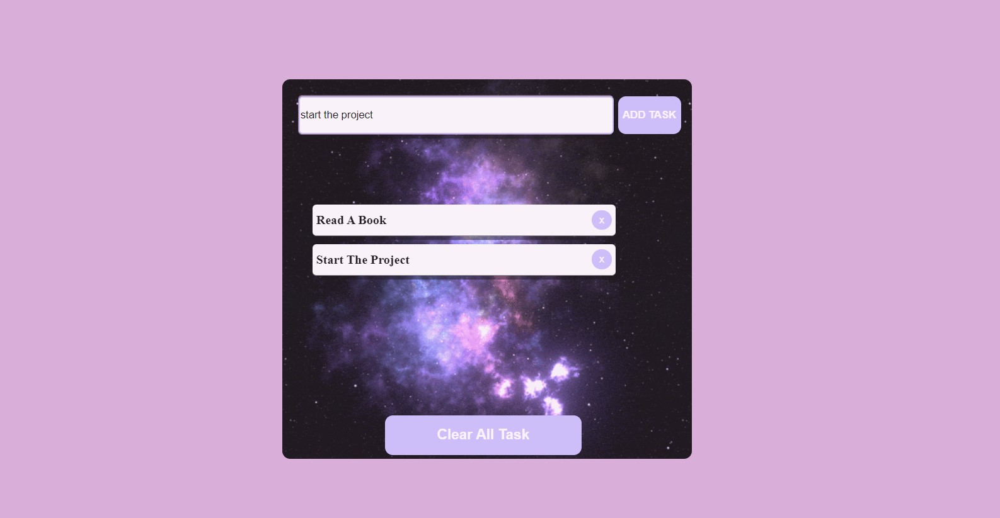

My To Do App

## Animation of the Website

## Visulation of the Website

## Description

Project aims get information about My To Do App via a Javascript.

## Learning Outcomes

At the end of the this project, you will be able to;

- improve coding skills within HTML & CSS & JS.

- use git commands (push, pull, commit, add etc.) and Github as Version Control System.
